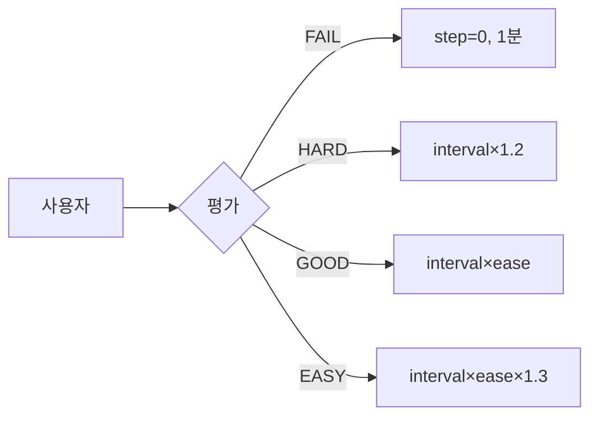
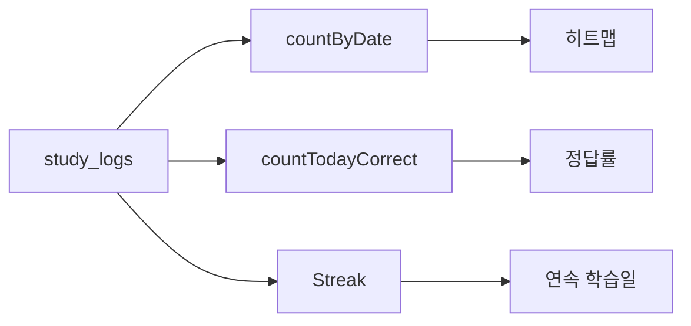
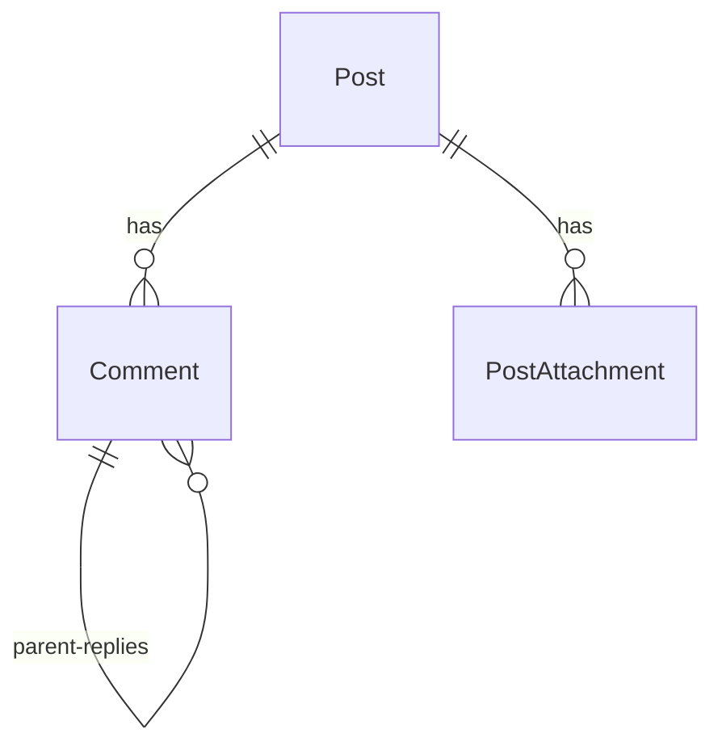
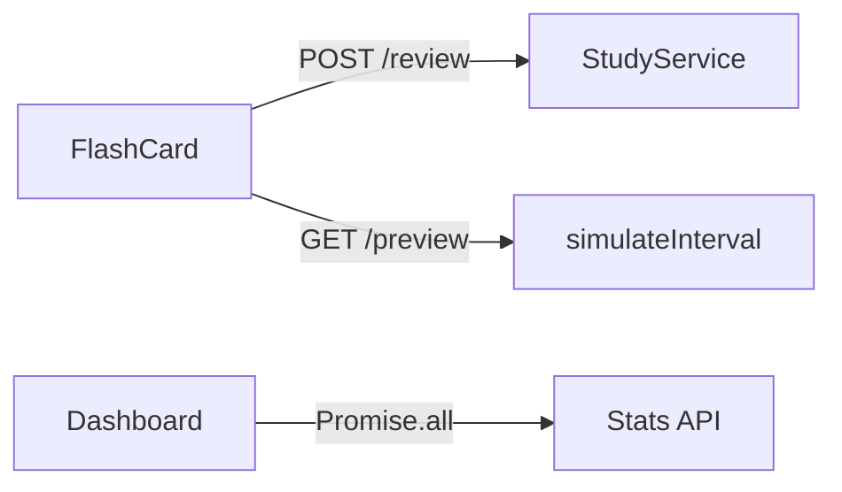
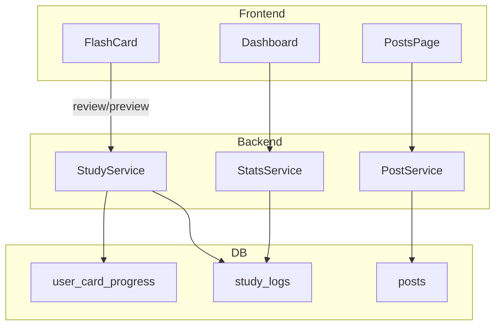

# PPT 슬라이드 내용 - 알고리즘 개발자 임문현

> 슬라이드당 다이어그램 1개. [Mermaid Live Editor](https://mermaid.live)에서 이미지로 내보낼 수 있습니다.

---

## 슬라이드 1: 학습 알고리즘

**기술:** Spring Boot, JPA, SM2Algorithm

**표**

| 평가 | 동작 |
|------|------|
| FAIL | step=0, 1분 |
| HARD | interval×1.2 |
| GOOD | interval×ease |
| EASY | interval×ease×1.3 |

**불릿**

- FAIL/HARD/GOOD/EASY에 따라 다음 복습 시각 계산
- 덱별 learningSteps (1분→10분)
- preview API로 버튼에 "1분", "1일" 표시

**다이어그램**

---

## 슬라이드 2: 학습 패턴 분석

**기술:** study_logs, StatsService, JPQL

**불릿**

- study_logs에 rating, studiedAt 저장
- countByDate → 히트맵 / countTodayCorrect → 정답률
- Streak: 오늘부터 역순 연속 학습일

**다이어그램**

---

## 슬라이드 3: 커뮤니티 기능

**기술:** Post, Comment, PostAttachment, searchWithAuthor

**불릿**

- isNotice DESC → 공지 상단 고정
- MultipartFile → UUID 저장 → 첨부파일
- parent_id → 대댓글

**다이어그램**

---

## 슬라이드 4: 사용자 소통

**기술:** React, Axios, react-activity-calendar

**불릿**

- 버튼 클릭 → POST /study/review (실시간 피드백)
- 카드 변경 → GET /study/preview (interval 미리보기)
- Promise.all → Streak, 히트맵

**다이어그램**

---

## [참고] 전체 시스템 흐름 (통합)

